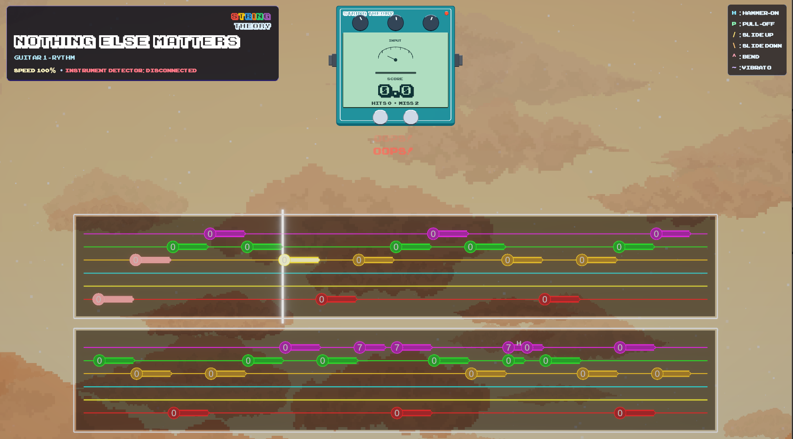
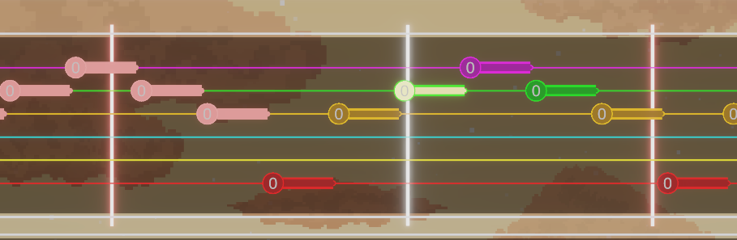

# StringTheory

StringTheory is a guitar game built in Unity that turns practice into something closer to a rhythm game.

You can load basically any song, pick the track you want, and play along while the game listens in real time.

Live note and chord detection powers the scoring system, so your performance is tracked while you play and practice feels competitive and fun.

## What it does today

- Live note detection and chord detection while you play
 
- A scoring system so you can track how well you are doing
  
- Looping for any section you select

- Slow down playback so hard parts are easier to learn
  
- Timing offset controls by track and by full song
  
- Instant track switching inside the same song

  
- Lots of settings for gameplay and practice behavior
  
- Early 3D view work has started, but it is still incomplete

There is also a simple amp simulator app included in the project.

NOTE:
The detector uses your system’s default recording device. Please set your guitar interface / mic as the default input before launching. For multi-input interfaces, use input 1.
Project will be updated to have a special UI to select input device next.

## Adding songs

Adding songs is intentionally very easy.

1. Create a folder inside the `songs` folder.
2. Put your `MusicXML` file in that folder.
3. Optionally add an `mp3` file in the same folder.

That is it. The song will show up directly in the game library.

If you prefer, you can open the songs folder from inside the game using the folder button in the library.

## Guitar Pro files (.gp)

If you have a `.gp` file, you can convert it to MusicXML in a minute.

Use a free tool such as TuxGuitar, open the `.gp` file, then export it as MusicXML.

The exported file works directly in StringTheory and loads tracks and guitar techniques automatically.

## Download

A prebuilt version of the game is available in the releases section. 
It is a first test of the build and is likely outdated.
You can unzip it and run the .exe to test.

## License

All C# source code in this repository is licensed under the MIT License.

Executable files (such as the note detection listener) are proprietary
software and are NOT covered by the MIT license. All rights reserved.

PS: notes/chords detection code will be opened for open source as well in a different repository soon.
