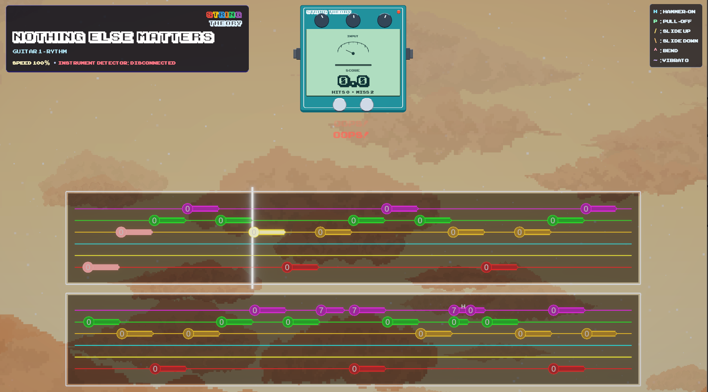
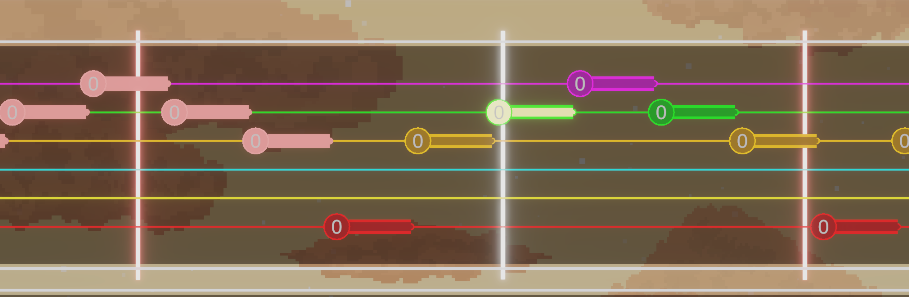
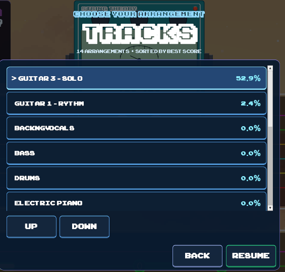

# StringTheory



StringTheory is a guitar game built in Unity that turns practice into something closer to a rhythm game.

You can load basically any song, pick the track you want, and play along while the game listens in real time.

Live note and chord detection powers the scoring system, so your performance is tracked while you play and practice feels competitive and fun.

## Repo note

This public repo is source-first.

Some bundled runtimes, third-party libraries, and packaged binaries are intentionally not checked in.

See [HOW_TO_BUILD.md](HOW_TO_BUILD.md) for the missing pieces and where they go.

## What it does today

- Live note detection and chord detection while you play
 
- A scoring system so you can track how well you are doing
  
- Looping for any section you select


- Slow down playback so hard parts are easier to learn
  
- Timing offset controls by track and by full song
  
- Instant track switching inside the same song

  
- Lots of settings for gameplay and practice behavior
  
- Early 3D view work has started, but it is still incomplete

There is also a simple amp simulator app included in the project.

## Adding songs

Adding songs is intentionally very easy.

1. Create a folder inside `Assets/StreamingAssets/Songs/`.
2. Put your notation file in that folder.
3. Optionally add an `mp3` file in the same folder.
4. Optionally add a `song.json` file for display metadata.

That is it. The song will show up directly in the game library.

If you prefer, you can open the songs folder from inside the game using the folder button in the library.

Example `song.json`:

```json
{
  "songId": "november-rain",
  "displayName": "November Rain",
  "subtitle": "Guns N' Roses",
  "difficulty": 4
}
```

Difficulty values:

- `1` Beginner
- `2` Novice
- `3` Standard
- `4` Advanced
- `5` Master

Supported notation formats:

- `.gp`, `.gp3`, `.gp4`, `.gp5`, `.gpx`
- `MusicXML`

## Recommended format

Use Guitar Pro files when possible.

They preserve guitar techniques and playback intent better than MusicXML, especially for bends, legato, and other expressive parts.

MusicXML still works, but it is better used as a fallback when a GP file is not available.

## Download

A prebuilt version of the game can be published in the Releases section.

This repo is source-first, so some bundled runtimes and third-party binaries are intentionally not checked in here.

If you are building from source, see [HOW_TO_BUILD.md](HOW_TO_BUILD.md).

## License

Project source code authored for StringTheory is licensed under the GNU General Public License v3.0.

Third-party components keep their own licenses. See:

- [THIRD_PARTY_NOTICES.md](THIRD_PARTY_NOTICES.md)

Some packaged executables, libraries, models, and other bundled runtimes are intentionally not included in this public repo.
