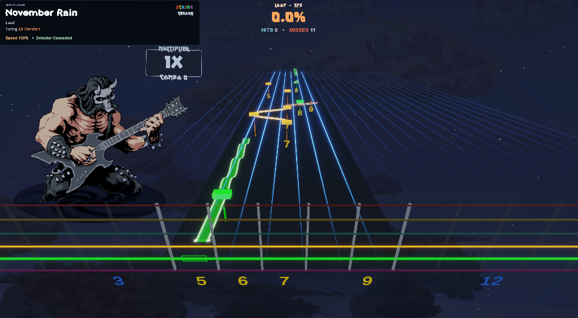
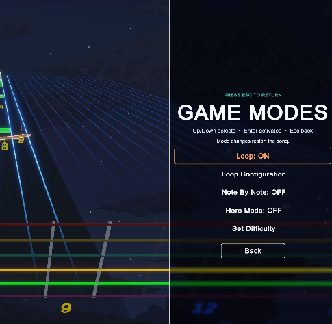
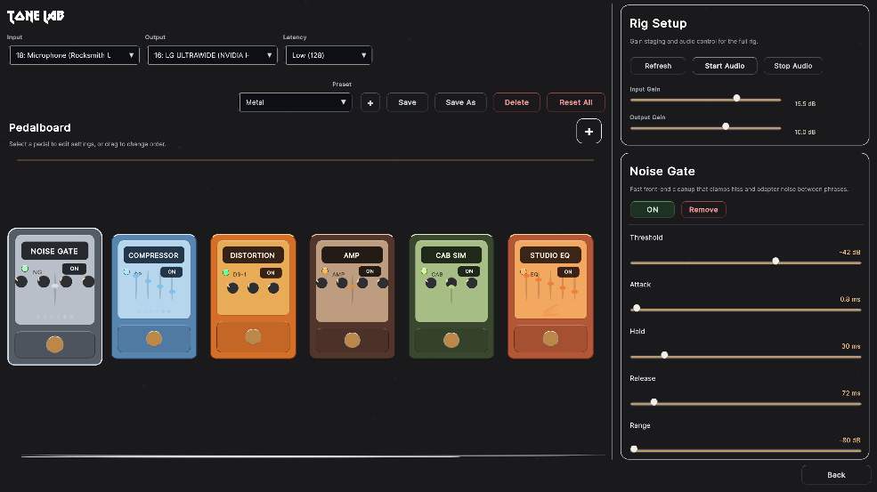
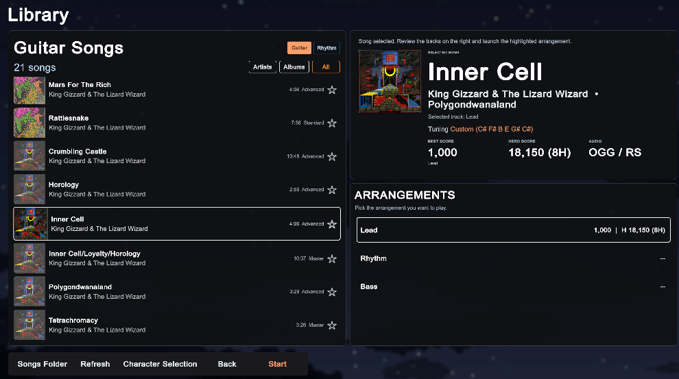
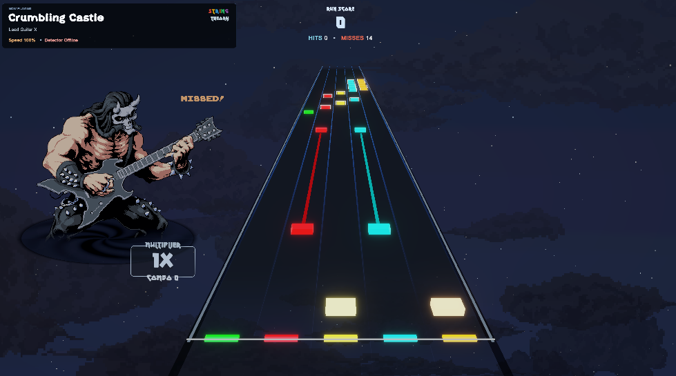
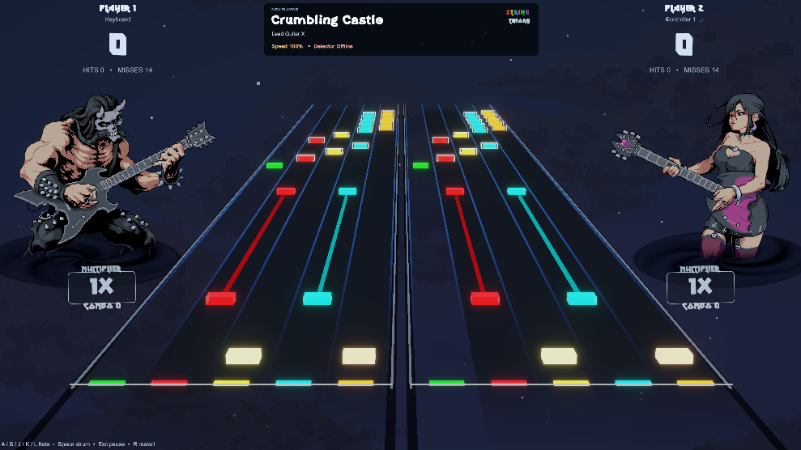

https://www.youtube.com/watch?v=8uV9ogkK5G4

# StringTheory



StringTheory is a Unity-based guitar and bass game built around real instrument input, scoring, and fast repetition of difficult passages. Load a song, choose a part, and play along while the game listens in real time with live **single-note** and **chord** detection.

It works both as a practice tool and as a score-driven play experience: you can drill sections, but you can also play full songs, chase better runs, and beat your previous scores. It also includes an arcade-style rhythm mode for chart-based play with keyboards, gamepads, and guitar controllers.

## Repo note

This public repo is source-first.

Some bundled runtimes, third-party libraries, and packaged binaries are intentionally not checked in.

See [HOW_TO_BUILD.md](HOW_TO_BUILD.md) for the missing pieces and where they go.

## Unity version

This project currently targets **Unity 6 / 6000.2.9f1**.

## Real instrument gameplay

StringTheory's main mode is built for playing with a real guitar or bass through a microphone, instrument cable, or low-latency audio interface.

- Live **single-note** detection
- Live **chord** detection
- Real-time **scoring**
- Track and arrangement selection
- **difficulty** selection for supported arrangements
- Track switching inside the same song
- Timing offset controls by track and by full song
- Support for both **Highway3D** and **Tabs** presentation modes

The goal is not just to display notes. The game judges what you actually play.

## Game and practice modes



StringTheory includes a set of focused practice modes for learning hard sections without leaving the song.

- **Guitar Mode**  
  The main real-instrument mode. Play with a real guitar or bass while the game scores your notes and chords.

- **Loop Mode**  
  Select any section of a song, repeat it until it is clean, and save loop bookmarks so you can return to the same practice spots quickly.

- **Note By Note Mode**  
  Stops at each note or chord until you play it correctly.

- **Hero Mode**  
  A higher-pressure practice mode with hearts and failure states.

- **Playback Speed Control**  
  Slow difficult passages down while keeping the rest of the workflow intact.

## Tone Lab



Tone Lab is built into the game so you do not need to leave StringTheory to shape your sound.

- Pedalboard-style signal chain editing
- Add, remove, reorder, and enable or disable pedals
- Edit pedal parameters directly in the UI
- Save presets
- Save As for new preset variants
- Delete presets
- Reset the preset library and active rig
- Input, output, and latency controls

Tone Lab is intended to keep the core practice loop tight: load song, pick part, shape tone, play.

## Adding songs



StringTheory is built around loading your own song files.

### `.psarc` files

You can simply drop `.psarc` files into `Assets/StreamingAssets/Songs/`, refresh the in-game library, and they will work without any extra setup.

The library imports the package on refresh and exposes its arrangements in the normal song flow, including difficulty changes for psarc arrangements that provide multiple difficulty levels.

### Other song file types

For Guitar Pro, MusicXML, rhythm charts, and other direct file-based song formats, add them as normal song folders:

1. Create a folder inside `Assets/StreamingAssets/Songs/`.
2. Put your song/chart files in that folder.
3. Optionally add audio and metadata files.
4. Refresh the library in game.

You can also open the songs folder directly from the in-game library UI.

Example `song.json`:

```json
{
  "songId": "november-rain",
  "displayName": "November Rain",
  "artist": "Guns N' Roses",
  "album": "Use Your Illusion I",
  "difficulty": 4
}
```

Difficulty values:

- `1` Beginner
- `2` Novice
- `3` Standard
- `4` Advanced
- `5` Master

### Supported real-instrument notation formats

- `.gp`
- `.gp3`
- `.gp4`
- `.gp5`
- `.gpx`
- `MusicXML`

## Track and arrangement selection

StringTheory is not limited to one fixed lane or one fixed chart interpretation per song.

Depending on the source file, the game can expose:

- Lead / rhythm / bass arrangements
- Multiple parts from the same score
- Psarc arrangement variants
- Difficulty selection for supported rhythm charts

That lets you practice the same song from different angles instead of treating each file as a single rigid playthrough.

## Rhythm mode



StringTheory also includes an arcade-style rhythm mode for supported chart files.

This mode is intended for Clone Hero / Guitar Hero-style play rather than real instrument detection.

- Supports `notes.chart`
- Supports `notes.mid` / `notes.midi`
- Supports `song.ini`
- Keyboard support
- Gamepad support
- Guitar controller support
- MIDI input support
- Score tracking
- Difficulty selection
- Arrangement / instrument selection

Supported rhythm instruments include:

- Guitar
- Bass
- Rhythm
- Co-op Guitar
- Keys
- Drums

## Local multiplayer rhythm



StringTheory includes local two-player rhythm multiplayer.

- Separate device assignment per player
- Shared song and difficulty
- Independent scoring
- Built for local play sessions on the same machine

Rhythm multiplayer is intentionally separate from the real-instrument guitar/bass workflow. It is a second way to use the same library with friends.

## Download

A prebuilt version of the game is published in the Releases section. You can download and try it directly.

If you are building from source, see [HOW_TO_BUILD.md](HOW_TO_BUILD.md).

## License

Project source code authored for StringTheory is licensed under the GNU General Public License v3.0.

Third-party components keep their own licenses. See:

- [THIRD_PARTY_NOTICES.md](THIRD_PARTY_NOTICES.md)

Some packaged executables, libraries, models, and other bundled runtimes are intentionally not included in this public repo.
